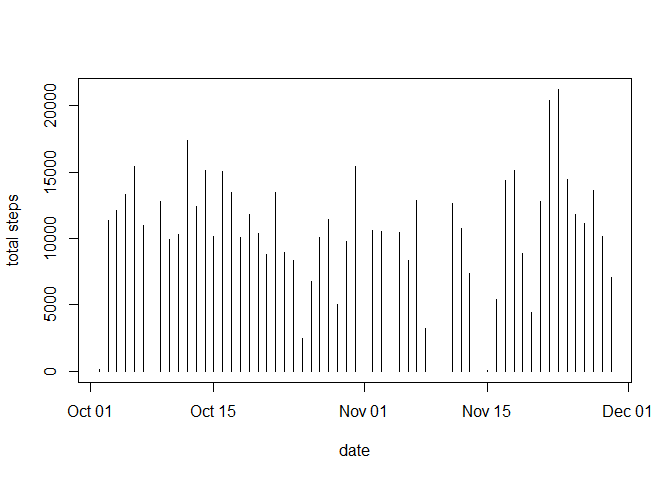
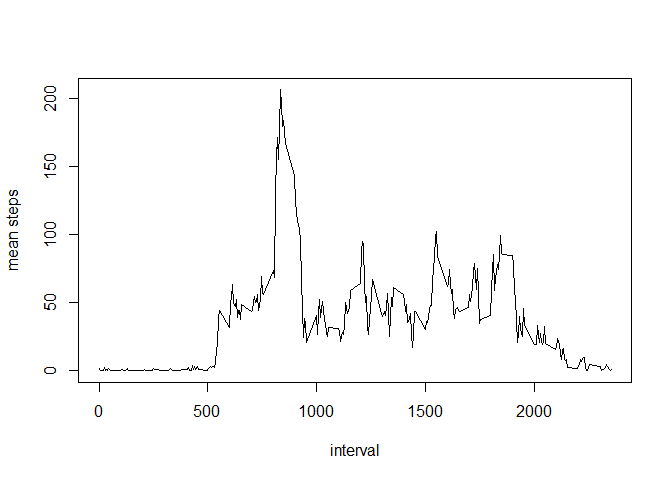
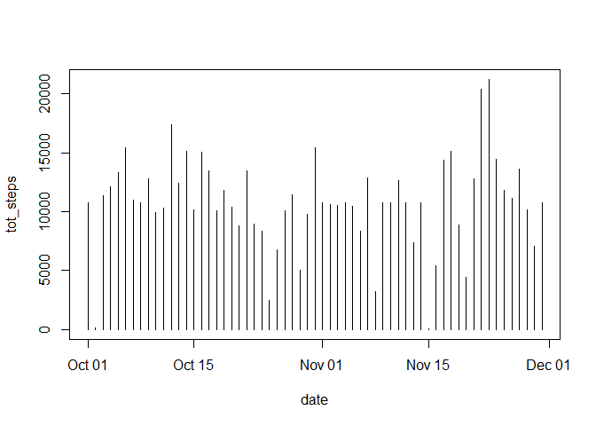
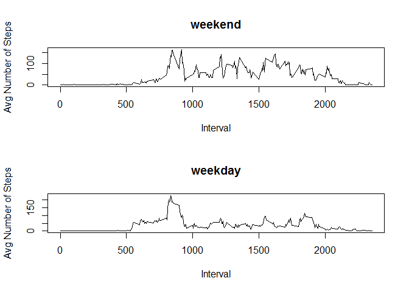

# Reproducible Research: Peer Assessment 1
Loading Libraries

```r
      library(knitr)
```

```
## Warning: package 'knitr' was built under R version 3.1.2
```

```r
      library(sqldf)
```

```
## Loading required package: gsubfn
## Loading required package: proto
## Loading required package: RSQLite
## Loading required package: DBI
## Loading required package: RSQLite.extfuns
```

Setting Global Echo to TRUE

```r
      opts_chunk$set(echo=TRUE)
```

## Loading and preprocessing the data

```r
      activity <- read.csv("activity.csv")
      activity$steps <- as.numeric(activity$steps)
      activity$date <- as.Date(activity$date, "%Y-%m-%d")
      activity$interval <- as.numeric(activity$interval)
      #head(activity)
      #str(activity)
      #summary(activity)
```

## What is mean total number of steps taken per day?

####Histogram 

```r
      df <- sqldf(
            "select *
            from activity
            where steps is not null")
```

```
## Loading required package: tcltk
```

```r
      df2 <- sqldf(
            "select date, sum(steps) AS tot_steps
            from df
            group by date")

      with(df2, plot(date, tot_steps, ylab = "total steps", type = "h"))
```

 

####Mean and Median of Total Steps per Day

```r
      df3 <- sqldf(
            "select date, avg(steps) AS mean_steps, median(steps) AS median_steps
            from df
            group by date")
      df3
```

```
##          date mean_steps median_steps
## 1  2012-10-02  0.4375000            0
## 2  2012-10-03 39.4166667            0
## 3  2012-10-04 42.0694444            0
## 4  2012-10-05 46.1597222            0
## 5  2012-10-06 53.5416667            0
## 6  2012-10-07 38.2465278            0
## 7  2012-10-09 44.4826389            0
## 8  2012-10-10 34.3750000            0
## 9  2012-10-11 35.7777778            0
## 10 2012-10-12 60.3541667            0
## 11 2012-10-13 43.1458333            0
## 12 2012-10-14 52.4236111            0
## 13 2012-10-15 35.2048611            0
## 14 2012-10-16 52.3750000            0
## 15 2012-10-17 46.7083333            0
## 16 2012-10-18 34.9166667            0
## 17 2012-10-19 41.0729167            0
## 18 2012-10-20 36.0937500            0
## 19 2012-10-21 30.6284722            0
## 20 2012-10-22 46.7361111            0
## 21 2012-10-23 30.9652778            0
## 22 2012-10-24 29.0104167            0
## 23 2012-10-25  8.6527778            0
## 24 2012-10-26 23.5347222            0
## 25 2012-10-27 35.1354167            0
## 26 2012-10-28 39.7847222            0
## 27 2012-10-29 17.4236111            0
## 28 2012-10-30 34.0937500            0
## 29 2012-10-31 53.5208333            0
## 30 2012-11-02 36.8055556            0
## 31 2012-11-03 36.7048611            0
## 32 2012-11-05 36.2465278            0
## 33 2012-11-06 28.9375000            0
## 34 2012-11-07 44.7326389            0
## 35 2012-11-08 11.1770833            0
## 36 2012-11-11 43.7777778            0
## 37 2012-11-12 37.3784722            0
## 38 2012-11-13 25.4722222            0
## 39 2012-11-15  0.1423611            0
## 40 2012-11-16 18.8923611            0
## 41 2012-11-17 49.7881944            0
## 42 2012-11-18 52.4652778            0
## 43 2012-11-19 30.6979167            0
## 44 2012-11-20 15.5277778            0
## 45 2012-11-21 44.3993056            0
## 46 2012-11-22 70.9270833            0
## 47 2012-11-23 73.5902778            0
## 48 2012-11-24 50.2708333            0
## 49 2012-11-25 41.0902778            0
## 50 2012-11-26 38.7569444            0
## 51 2012-11-27 47.3819444            0
## 52 2012-11-28 35.3576389            0
## 53 2012-11-29 24.4687500            0
```

## What is the average daily activity pattern?

####Times Series 

```r
      df4 <- sqldf(
            "select interval, avg(steps) AS mean_steps
            from df
            group by interval")

      with(df4, plot(interval, mean_steps, ylab = "mean steps", type = "l"))
```

 

####Intereval with the Maximum Number of Steps

```r
      df5 <- sqldf(
            "select interval, mean_steps AS steps
            from df4
            where mean_steps =
                  (select max(mean_steps)
                  from df4)")

      df5
```

```
##   interval    steps
## 1      835 206.1698
```

## Imputing missing values

####Total Missing Values

```r
      df6 <- sqldf(
            "select *
                  from activity
                  where steps is null")

      nrow(df6)
```

```
## [1] 2304
```

####Imputing Missing Values with Interval Mean

```r
activity2 <- sqldf(
      "select 
            case
                  when a.steps is null then mean_steps
                  else a.steps 
            end AS steps, 
            a.date,
            a.interval
      from activity a
            left outer join df4 d on a.interval= d.interval")
```

####Histogram with Imputed Data

```r
      df7 <- sqldf(
            "select date, sum(steps) AS tot_steps
            from activity2
            group by date")

      with(df7, plot(date, tot_steps, type = "h"))
```

 

####Mean and Median of Total Steps per Day with Imputed Data

```r
      df8 <- sqldf(
            "select date, avg(steps) AS mean_steps, median(steps) AS median_steps
            from activity2
            group by date")
      df8
```

```
##          date mean_steps median_steps
## 1  2012-10-01 37.3825996     34.11321
## 2  2012-10-02  0.4375000      0.00000
## 3  2012-10-03 39.4166667      0.00000
## 4  2012-10-04 42.0694444      0.00000
## 5  2012-10-05 46.1597222      0.00000
## 6  2012-10-06 53.5416667      0.00000
## 7  2012-10-07 38.2465278      0.00000
## 8  2012-10-08 37.3825996     34.11321
## 9  2012-10-09 44.4826389      0.00000
## 10 2012-10-10 34.3750000      0.00000
## 11 2012-10-11 35.7777778      0.00000
## 12 2012-10-12 60.3541667      0.00000
## 13 2012-10-13 43.1458333      0.00000
## 14 2012-10-14 52.4236111      0.00000
## 15 2012-10-15 35.2048611      0.00000
## 16 2012-10-16 52.3750000      0.00000
## 17 2012-10-17 46.7083333      0.00000
## 18 2012-10-18 34.9166667      0.00000
## 19 2012-10-19 41.0729167      0.00000
## 20 2012-10-20 36.0937500      0.00000
## 21 2012-10-21 30.6284722      0.00000
## 22 2012-10-22 46.7361111      0.00000
## 23 2012-10-23 30.9652778      0.00000
## 24 2012-10-24 29.0104167      0.00000
## 25 2012-10-25  8.6527778      0.00000
## 26 2012-10-26 23.5347222      0.00000
## 27 2012-10-27 35.1354167      0.00000
## 28 2012-10-28 39.7847222      0.00000
## 29 2012-10-29 17.4236111      0.00000
## 30 2012-10-30 34.0937500      0.00000
## 31 2012-10-31 53.5208333      0.00000
## 32 2012-11-01 37.3825996     34.11321
## 33 2012-11-02 36.8055556      0.00000
## 34 2012-11-03 36.7048611      0.00000
## 35 2012-11-04 37.3825996     34.11321
## 36 2012-11-05 36.2465278      0.00000
## 37 2012-11-06 28.9375000      0.00000
## 38 2012-11-07 44.7326389      0.00000
## 39 2012-11-08 11.1770833      0.00000
## 40 2012-11-09 37.3825996     34.11321
## 41 2012-11-10 37.3825996     34.11321
## 42 2012-11-11 43.7777778      0.00000
## 43 2012-11-12 37.3784722      0.00000
## 44 2012-11-13 25.4722222      0.00000
## 45 2012-11-14 37.3825996     34.11321
## 46 2012-11-15  0.1423611      0.00000
## 47 2012-11-16 18.8923611      0.00000
## 48 2012-11-17 49.7881944      0.00000
## 49 2012-11-18 52.4652778      0.00000
## 50 2012-11-19 30.6979167      0.00000
## 51 2012-11-20 15.5277778      0.00000
## 52 2012-11-21 44.3993056      0.00000
## 53 2012-11-22 70.9270833      0.00000
## 54 2012-11-23 73.5902778      0.00000
## 55 2012-11-24 50.2708333      0.00000
## 56 2012-11-25 41.0902778      0.00000
## 57 2012-11-26 38.7569444      0.00000
## 58 2012-11-27 47.3819444      0.00000
## 59 2012-11-28 35.3576389      0.00000
## 60 2012-11-29 24.4687500      0.00000
## 61 2012-11-30 37.3825996     34.11321
```

## Are there differences in activity patterns between weekdays and weekends?

####Creating Day Type Variable

```r
      day_type <- weekdays(activity2$date)

      df9 <- cbind(activity2, day_type)

      df10 <- sqldf(
            "select steps,
            date,
            interval,
            case
                  when day_type in ('Saturday', 'Sunday') then 'weekend'
                  when day_type is null then null
                  else 'weekday'
            end as day_type
            from df9")
```

####Panel Plot

```r
df11_wday <- sqldf(
      "select interval, avg(steps) as mean_steps
      from df10
      where day_type = 'weekday'
      group by interval")

df11_wend <- sqldf(
      "select interval, avg(steps) as mean_steps
      from df10
      where day_type = 'weekend'
      group by interval")

par(mfcol = c(2, 1))

with(df11_wend, plot(interval, mean_steps, type = "l", main="weekend", xlab = "Interval", ylab="Avg Number of Steps"))

with(df11_wday, plot(interval, mean_steps, type = "l", main="weekday", xlab="Interval", ylab="Avg Number of Steps"))
```

 

```r
par(mfcol = c(1, 1))
```
